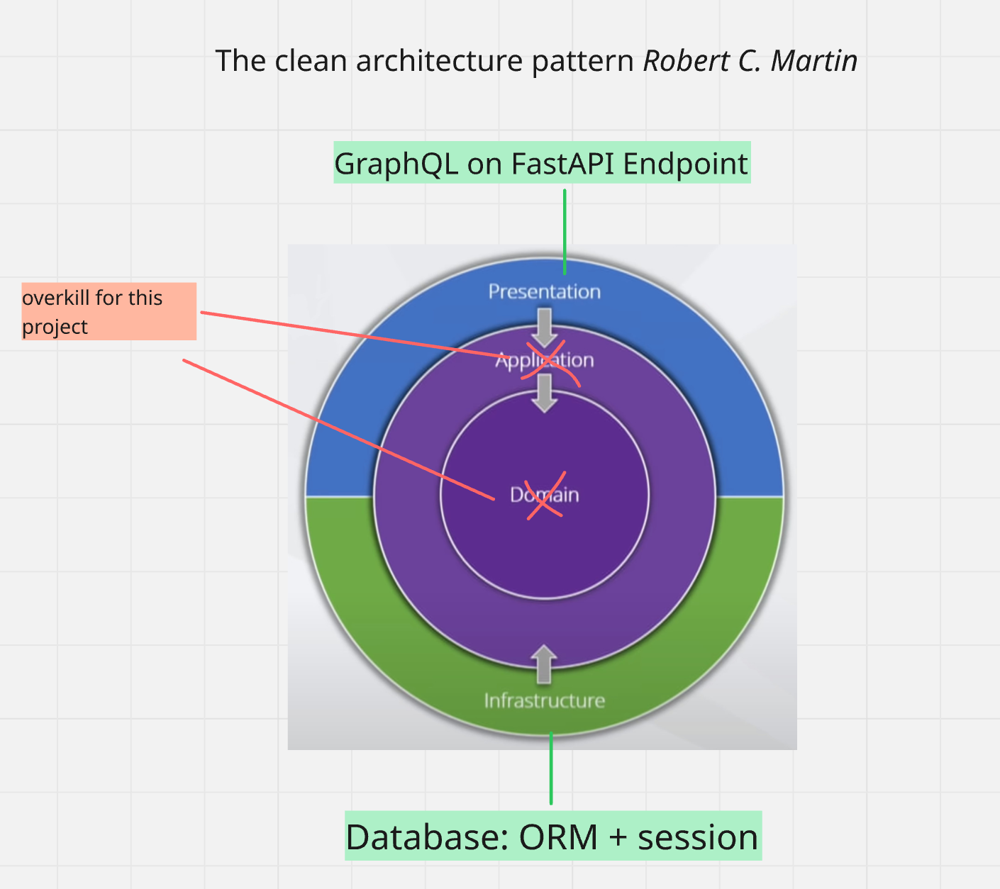
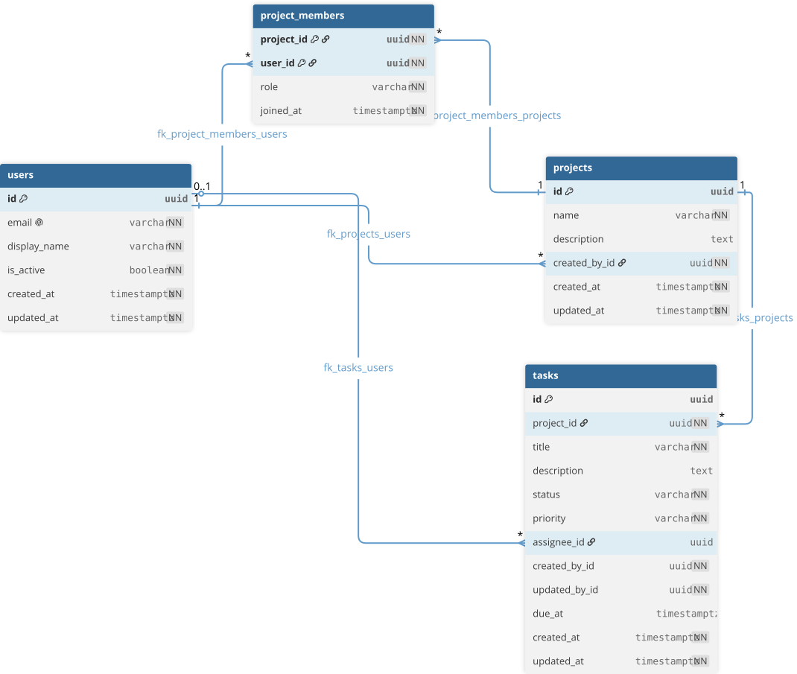

# Task Management API: Assignment Implementation Summary

The solution prioritizes a small, runnable GraphQL API with explicit authorization,
validated inputs, efficient relationship loading, and meaningful tests.

Live EC2 deployment: [https://lush.andrewkravchuk.com/](https://lush.andrewkravchuk.com/)

## Quick Start


The primary workflow requires only Docker with the Compose v2 plugin. Python,
PostgreSQL, `uv`

### 1. Verify Docker

```bash
docker --version
docker compose version
```

### 2. Start the application

```bash
docker compose up -d --build --wait
```

Docker Compose automatically loads `compose.override.yaml`; the API applies Alembic
migrations and inserts the idempotent development seed before starting.

### 3. Verify the containers

```bash
docker compose ps
```

PostgreSQL should report `healthy`, and the API should report `running`. Opening
`http://localhost:8000/health` should return:

```json
{"status": "ok"}
```

### 4. Run the GraphiQL examples

Open [http://localhost:8000/example](http://localhost:8000/example). It redirects to
GraphiQL with the following panels already populated:

- **Query:** named successful and failing query and mutation examples.
- **Variables:** seeded project values and task placeholders used by those operations.
- **Headers:** the seeded owner's `X-User-ID` development identity.

The prefilled values are defined in
[`graphiql_example.py`](src/task_api/presentation/graphql/graphiql_example.py).
Select an operation in GraphiQL, run it, and follow its inline comments; operations
that use `taskId` require the ID returned by `CreateTemporaryTask`.

### 5. Stop the application

Keep the PostgreSQL data for the next run:

```bash
docker compose down
```

Or stop the application and permanently delete the local PostgreSQL data:

```bash
docker compose down --volumes
```


## Technology

| Technology | Why |
| --- | --- |
| Python 3.11+ | Required by the assignment and provides strong typing with a mature async ecosystem. |
| FastAPI + Uvicorn | Provides ASGI request handling, dependency injection, and the application server. |
| Strawberry | Implements the required code-first GraphQL schema with typed resolvers. |
| Pydantic | Validates and normalizes GraphQL inputs before persistence. |
| SQL | Membership, authorization, and ownership require joins, transactions, and enforced integrity. |
| PostgreSQL 17 | Provides UUIDs, timezone-aware timestamps, constraints, composite indexes, and `RETURNING`. |
| SQLAlchemy + `asyncpg` | Keeps SQL explicit while providing typed models and non-blocking database access. |
| Alembic | Applies ordered, reviewable schema changes instead of creating tables at startup. |
| Async I/O | Allows the ASGI worker to serve other requests while waiting for PostgreSQL. |
| Docker Compose | Runs the API and real PostgreSQL consistently without host setup. |
| `uv` | Manages the local environment and development dependencies. |
| Pytest | Verifies unit, repository, migration, and GraphQL API behavior. |

## Project structure



The project keeps only Clean Architecture's useful boundaries: GraphQL presentation
and database infrastructure; separate application and domain layers would add
indirection without enough business logic to justify them.

```text
src/task_api/
├── enums/                         # One public enum per file
├── infrastructure/database/
│   ├── models/                    # SQLAlchemy persistence models
│   ├── repositories/              # Generic and task-specific database access
│   └── session.py                 # Async engine and request session
├── presentation/graphql/
│   ├── errors/                    # Safe structured GraphQL exceptions
│   ├── loaders/                   # Batched user and project loading
│   ├── resolvers/                 # Access checks, queries, and mutations
│   ├── schemas/                   # Root Strawberry schema
│   ├── types/
│   │   ├── inputs/                # GraphQL inputs and Pydantic data models
│   │   └── outputs/               # GraphQL response objects
│   ├── context.py                 # Request dependencies
│   └── safe_graphql_router.py     # Unexpected-error masking
├── main.py                        # FastAPI routes and GraphQL router
└── seed.py                        # Idempotent local demonstration data
```

## Data model



| Decision | Why |
| --- | --- |
| Separate `project_members` table | Models many-to-many membership, prevents duplicates, and stores authorization roles. |
| Task belongs to one project | Makes project membership the visibility boundary and allows project-owned data to cascade. |
| Nullable assignee with audit users | Supports unassigned tasks while preserving who created and last changed each task. |


## GraphQL API

The root definitions are in
[`presentation/graphql/schemas`](src/task_api/presentation/graphql/schemas).

| Operation | Kind | Purpose |
| --- | --- | --- |
| `task(id)` | Query | Fetch one visible task. |
| `tasks(filter, sort, page, perPage)` | Query | List visible tasks with filtering, sorting, and pagination. |
| `createTask(input)` | Mutation | Create a task in a project visible to the actor. |
| `updateTask(id, input)` | Mutation | Change editable task fields. |
| `changeTaskStatus(id, status)` | Mutation | Apply a valid workflow transition. |
| `setTaskAssignee(id, assigneeId)` | Mutation | Assign an active project member or clear the assignee. |
| `deleteTask(id)` | Mutation | Delete a task as the project owner. |

GraphQL names use Strawberry's automatic camel-case conversion while Python code
retains snake_case naming.

Runnable examples are prefilled at
[`http://localhost:8000/example`](http://localhost:8000/example) (local) and
[`https://lush.andrewkravchuk.com/example`](https://lush.andrewkravchuk.com/example) (prod) .

## Authentication and authorization

Authentication is deliberately stubbed through the `X-User-ID` request header.
Every operation verifies that the identified user exists and is active.

Authorization rules are:

- A user sees tasks only through project membership.
- Project members may create and edit tasks in their projects.
- An assignee must be an active member of the project.
- Only a project owner may delete a task.

## Errors

[`safe_graphql_router.py`](src/task_api/presentation/graphql/safe_graphql_router.py)
preserves expected GraphQL errors and masks unexpected exception details:

```python
if error.original_error is None or isinstance(error.original_error, TaskError):
    return error

return GraphQLError(
    "Internal server error.",
    nodes=error.nodes,
    path=error.path,
    extensions={"code": "INTERNAL_SERVER_ERROR"},
)
```

Expected failures are raised as client-safe GraphQL errors with stable
`extensions.code` values:

- `UNAUTHENTICATED`, with a specific authentication reason
- `FORBIDDEN`
- `NOT_FOUND`
- `VALIDATION_ERROR`, with structured field details
- `INVALID_ASSIGNEE`
- `INVALID_STATUS_TRANSITION`, with current and requested statuses

Expected errors appear in GraphQL's standard top-level `errors` list. A custom router
preserves these errors while replacing unexpected exception messages with
`INTERNAL_SERVER_ERROR`, preventing stack traces or internal details from leaking.
```json
{
  "data": null,
  "errors": [
    {
      "message": "A valid X-User-ID header is required.",
      "locations": [
        {
          "line": 3,
          "column": 3
        }
      ],
      "path": [
        "createTask"
      ],
      "extensions": {
        "code": "UNAUTHENTICATED",
        "reason": "MISSING_CREDENTIALS"
      }
    }
  ]
}
```

## Persistence and concurrency

Updates use **last-write-wins**: a later commit replaces an earlier value instead of
rejecting the save with a version conflict, which suits Jira-style editing but can
silently overwrite concurrent work.

```python
# Request 1 commits first.
await TaskRepository(first_request_session).update_fields(
    task_id,
    {"title": "First edit"},
    updated_by_id=first_user_id,
)
await first_request_session.commit()

# Request 2 commits later, so this title becomes the stored value.
await TaskRepository(later_request_session).update_fields(
    task_id,
    {"title": "Later edit"},
    updated_by_id=later_user_id,
)
await later_request_session.commit()
```

## Pagination

Offset pagination mirrors a familiar numbered-page UI and returns both the current
items and navigation metadata; the repository runs `COUNT(*)` plus a deterministic
`LIMIT/OFFSET` query, with `perPage` capped at 100.

For a query selecting only the pagination fields, GraphQL returns:

```json
{
  "data": {
    "tasks": {
      "total": 1134,
      "page": 1,
      "pages": 142,
      "perPage": 8,
      "nextPage": 2,
      "prevPage": null,
      "lastPage": 142
    }
  }
}
```

## Testing
| Level | What and why | Examples |
| --- | --- | --- |
| Unit | Checks validation, error payloads, pagination metadata, and DataLoader behavior without external I/O. | [`tests/unit`](tests/unit) |
| Integration | Uses real PostgreSQL to verify migrations, repository SQL, visibility filters, totals, and commits. | [`tests/integration`](tests/integration) |
| API | Calls the ASGI app through HTTP to verify GraphQL authentication, authorization, nested fields, and mutations. | [`tests/api`](tests/api) |

Database tests run against a dedicated PostgreSQL container. Test sessions use an
outer transaction and SQLAlchemy savepoints so resolver-level `commit()` calls can be
tested while each test remains isolated, following SQLAlchemy's
[external-transaction test pattern](https://docs.sqlalchemy.org/en/21/orm/session_transaction.html#joining-a-session-into-an-external-transaction-such-as-for-test-suites).

Testing requires Docker and `uv`. Start the isolated PostgreSQL test database:

```bash
docker compose -f compose.test.yaml up -d --wait
```

Run the tests:

```bash
uv run --extra dev pytest -v
```

Expected result: `23 passed`.

```bash
collected 23 items

tests/api/test_authentication.py::test_missing_user_header_returns_unauthenticated_error PASSED                 [  4%]
tests/api/test_authentication.py::test_inactive_user_returns_specific_authentication_reason PASSED              [  8%]
tests/api/test_task_mutations.py::test_create_task_commits_inside_rollback_isolated_session PASSED              [ 13%]
tests/api/test_task_mutations.py::test_invalid_status_transition_returns_structured_error PASSED                [ 17%]
tests/api/test_task_mutations.py::test_only_project_owner_can_delete_task PASSED                                [ 21%]
tests/api/test_task_queries.py::test_tasks_returns_only_visible_tasks_with_relationships PASSED                 [ 26%]
tests/integration/test_repositories.py::test_generic_repository_crud_survives_application_commit PASSED         [ 30%]
tests/integration/test_repositories.py::test_task_repository_limits_visibility_and_returns_total PASSED         [ 34%]
tests/integration/test_repositories.py::test_task_repository_applies_status_and_unassigned_filters PASSED       [ 39%]
tests/integration/test_schema.py::test_migrations_create_required_tables PASSED                                 [ 43%]
tests/unit/test_errors.py::test_unauthenticated_error_uses_predefined_reason PASSED                             [ 47%]
tests/unit/test_errors.py::test_unexpected_error_message_is_masked PASSED                                       [ 52%]
tests/unit/test_generic_loader.py::test_loader_batches_caches_and_aligns_results PASSED                         [ 56%]
tests/unit/test_task_inputs.py::test_create_task_rejects_invalid_title[] PASSED                                 [ 60%]
tests/unit/test_task_inputs.py::test_create_task_rejects_invalid_title[   ] PASSED                              [ 65%]
tests/unit/test_task_inputs.py::test_create_task_rejects_invalid_title[xxxxx] PASSED                            [ 69%]
tests/unit/test_task_inputs.py::test_update_task_requires_at_least_one_change PASSED                            [ 73%]
tests/unit/test_task_inputs.py::test_update_task_preserves_explicit_null_description PASSED                     [ 78%]
tests/unit/test_task_inputs.py::test_null_assignee_filter_selects_unassigned_tasks PASSED                       [ 82%]
tests/unit/test_task_inputs.py::test_page_data_rejects_values_outside_limits[0-24] PASSED                       [ 86%]
tests/unit/test_task_inputs.py::test_page_data_rejects_values_outside_limits[1-0] PASSED                        [ 91%]
tests/unit/test_task_inputs.py::test_page_data_rejects_values_outside_limits[1-101] PASSED                      [ 95%]
tests/unit/test_task_page.py::test_task_page_calculates_navigation PASSED                                       [100%]

================================================= 23 passed in 0.35s ==================================================
(lush-task-management-api) PC@MacBook-Air-2 lush-home-task %
```

Stop and remove the test database:

```bash
docker compose -f compose.test.yaml down
```


